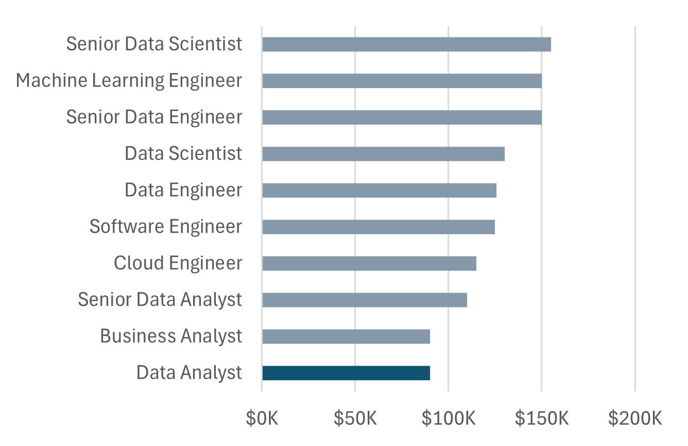
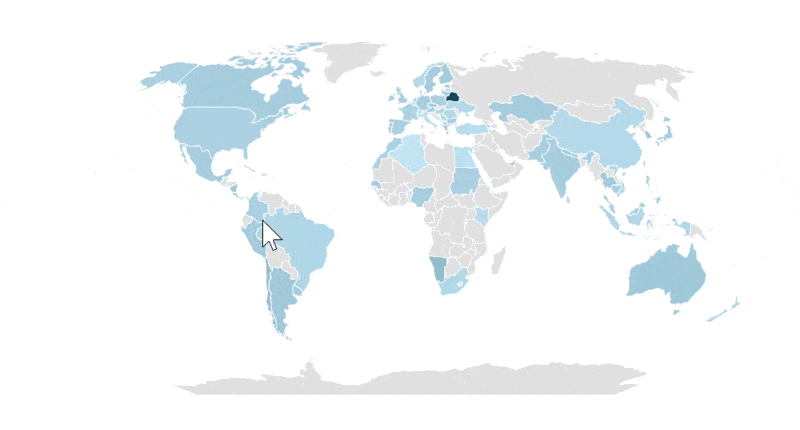
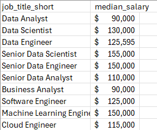
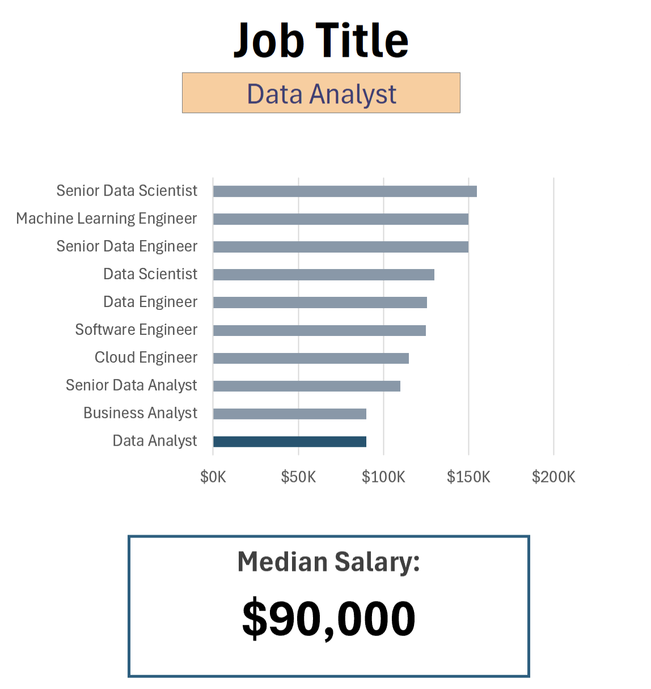
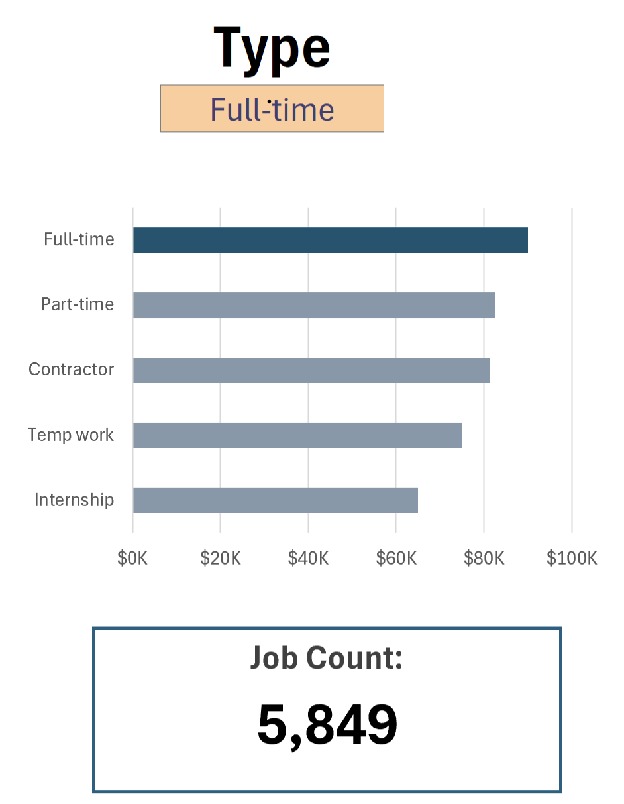
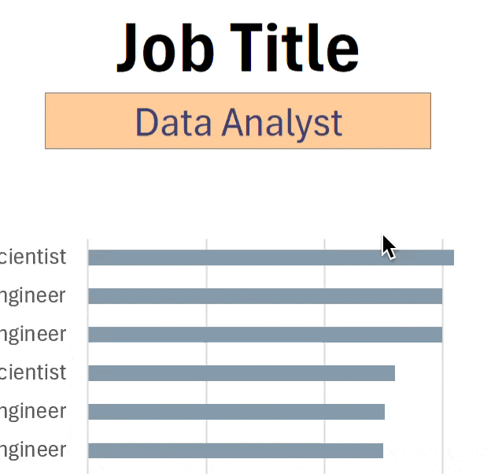

# Excel Salary Dashboard 


## Introduction
This Salay dashboard helps data job seekers to determine the Median salaries of different data roles across countries.

## Dashboard File  
My Final dashboard is in [1_Salary_Dashboard.xlsx](1_Salary_Dashboard.xlsx)  

## Data Job Datasets  
The dataset used for this project contains real-world data science job information from 2023. The dataset is available via Luke Barousse's Excel course, which provides a foundation for analyzing data using Excel. It includes detailed information on:

- Job titles
- Salaries
- Locations
- Skills

## Excel Skills Used  
- Charts
- Formulas and Functions
- Data Validation

## Dashboard Build 
1. **Charts**  
**Data Science Job Salaries - Bar Chart** 
 
- **🔧 Excel Features**: Created a horizontal bar chart with currency-formatted axis ($K) and clean layout for accurate comparison.
- **🎨 Design Choice**: Used horizontal bars to improve readability of long job titles and enhance visual clarity.
- **📊 Data Organization**: Sorted roles in descending order of median salary to establish a clear ranking structure.
- **💡 Insights Gained**: Senior and engineering roles significantly out-earn analyst roles, highlighting a strong salary progression in data careers.  
**Country Median Salaries - Map Chart**  
  
- **🌍 Excel Features** : Created a filled map chart with color scaling to show salary differences by country.
- **🎨 Design Choice**: Used a gradient color scheme to highlight higher-paying regions clearly.
- **📊 Data Organization**: Aggregated median salaries by country for accurate geographic comparison.
- **🔍 Interactivity**: Added hover tooltips to display exact salary values.
- **💡 Insights Gained**: Salaries are highest in North America and Europe, showing clear global gaps.  

**2. Formulas and Functions**  

**Median Salary by Job Titles**
```excel
=MEDIAN(
 IF(
  (jobs[job_title_short]=A2)*
  (jobs[job_country]=country)*
  (ISNUMBER(SEARCH(type,jobs[job_schedule_type])))*
  (jobs[salary_year_avg]<>0),
  jobs[salary_year_avg]
 )
)    
```
- **🧮 Formula Logic**: Built an array formula using MEDIAN + IF to calculate median salary under multiple conditions.   
- **🔍 Multi-Condition Filtering**: Applied boolean logic (*) to filter by job title, country, and job type simultaneously.  
- **⚙️ Text Matching**: Used SEARCH + ISNUMBER to handle partial matches for job schedule types. 

**Result**: This table in the background:  

   

To implement this dashboard below:   

  

**Count of Job Schedule Type**  

```excel
=FILTER(J2#,(NOT(ISNUMBER(SEARCH("and",J2#))+ISNUMBER(SEARCH(",",J2#))))*
(J2#<>0)
)
```   

- **🧮 Formula Use**: Applied FILTER to extract relevant job schedule types.
- **🔍 Data Cleaning**: Removed entries containing “and” to keep categories consistent.
- **⚙️ Logic Handling**: Used SEARCH + ISNUMBER to control inclusion criteria.   

**Result**: This table in the background:   

  
 
 **3. Data Validation**  

 
  
  ## Conclusion 
  I created this Salary dashboard as part of learning how to apply the Excel skills above mentioned. This is helpful to Data job seekers to make better infomred decisions about their career in any country.